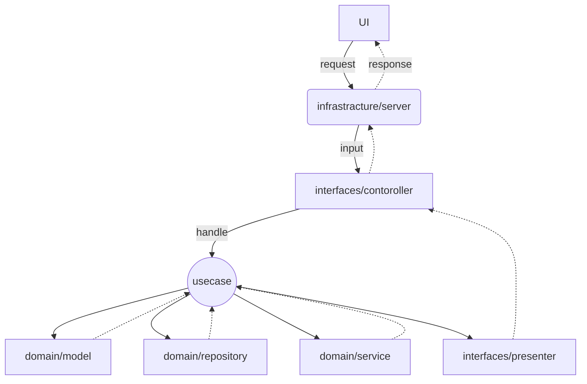

# go-clean-architecture

# Requirement
* Go 1.18.*
* gin 1.7.* (web framework)
* goose (db migration)
* gorm v2 1.22.* (orm)


# Architecture


# Code Structure

<details>
    <summary>ディレクトリ構成</summary>

```
.
├── db
├── image
├── src
│   ├── config
│   ├── domain          // Entitises(黄色)
│   ├── gateway         // Gateway(緑色)
│   ├── infrastructure  // External Interfaces(青色)
│   ├── interfaces      // Interfaces(緑色)
│   ├── middleware　　　 // Middleware
│   ├── registry        // DI用関数
│   ├── testutil        // test用関数
│   ├── usecase         // UseCase(赤色)
│   └── util
├── Dockerfile     //productuin用
├── Dockerfile.dev //開発用
├── READNE.md
├── entrypoint.sh  //Dockerfileの起点
├── go.mod
├── go.sum
└── main.go          //起点
```



### domain
#### model
ビジネスロジックを定義する
1. entity
2. value object
 
#### repository
gatewayのinterfaceを定義する
modelの入出力のinterface

#### service
modelの責務から外れる or 複数のmodelを操作する際に記述

### gateway
repositoryの具体的な実装
外部データ取得

### infrastructure
外部との通信
1. http
2. DB
3. API
4. etc
5. 
### interfaces
#### controller
APIとしての入り口
入力を解釈し、usecaseを呼び出す
#### presenter
表示データの加工を記述する

### middleware
入出力の通信を制御する

### registry
DIする関数を定義する
1. repository
2. usecase
3. etc

### testutil
テスト用の汎用関数を定義する

### usecase
アプリケーション固有のビジネスロジックを記述する
domainを使ってユースケースの目的を達成する

### util
汎用的に使う関数を定義する


</details>

# Author
Sei-Yukinari

# License
MIT License